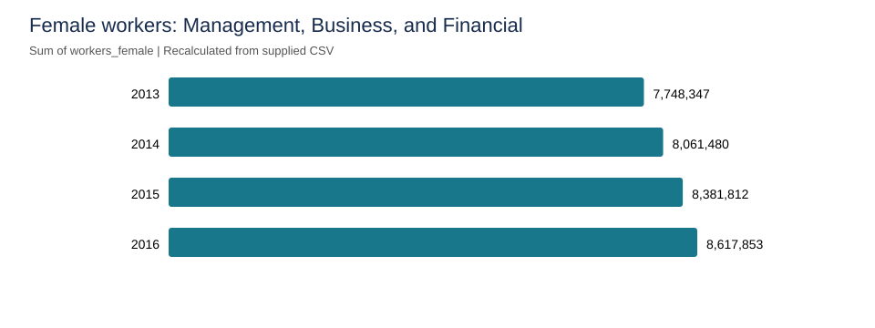

# Employment and Earnings Analysis with Azure SQL

A cloud-based SQL analysis of employment and earnings fields across occupations, years, and gender, developed for **MIE1628: Cloud-Based Data Analytics** at the University of Toronto.

## Project overview

The coursework demonstrates a data ingestion workflow using Azure Storage, Azure Data Factory, and Azure SQL Database, followed by nine analytical questions. The report includes resource setup, a Data Factory copy activity and run history, and SQL queries with their results.

**Tools:** Azure Blob Storage, Azure Data Factory, Azure SQL Database, T-SQL, Azure Resource Manager.

## Analysis covered

- Filter computer, engineering, and science occupations for 2013.
- Count distinct business and financial operations occupations.
- Retrieve bus driver records across years.
- Summarize female worker counts in management, business, and financial occupations by year.
- Aggregate the male earnings field for service occupations in 2015.
- Calculate female worker counts in management for 2015.
- Compare male and female earnings field sums by year.
- Aggregate the female earnings field for occupation names containing `engineer` in 2016.
- Compare male and female worker counts by year.

The SQL file contains ten statements: the first question includes both full records and a distinct occupation list.

## Verified dataset results

The supplied CSV contains **2,088 records**, covering **522 occupation records in each year from 2013 through 2016**, with no duplicate year/occupation keys.

| Year | Female workers in Management, Business, and Financial |
| --- | ---: |
| 2013 | 7,748,347 |
| 2014 | 8,061,480 |
| 2015 | 8,381,812 |
| 2016 | 8,617,853 |

There are **28 distinct occupations** in Business and Financial Operations, and **5,166,720 female workers** in the Management minor category in 2015. These values were independently recalculated from the CSV in Python and agree with the original report. They are sums of the supplied worker fields; earnings-field sums are not interpreted as total payroll.

## Repository contents

| File | Purpose |
| --- | --- |
| [sql/analysis.sql](sql/analysis.sql) | Queries transcribed from the original report, with their logic preserved |
| [docs/analysis-notes.md](docs/analysis-notes.md) | Data assumptions, query limitations, and validation status |
| [docs/reproduction.md](docs/reproduction.md) | Requirements and steps for reproducing the analysis |

## Running the analysis

1. Obtain the original employment dataset and its data dictionary.
2. Load the data into Azure SQL Database as `dbo.genderdata`, preserving the column names expected by the queries.
3. Review [reproduction requirements](docs/reproduction.md) and [analysis notes](docs/analysis-notes.md).
4. Execute statements individually from [analysis.sql](sql/analysis.sql) in an Azure SQL-compatible query editor.

## Data and reproducibility status

The original report and screenshots document the Azure workflow. The subsequently supplied `gender_jobs_data.csv` was checked locally, and worker-count results were recalculated in Python. The SQL has not been rerun against a live Azure database.

The source publisher, data dictionary, license, and exported Azure Data Factory configuration are still unavailable. The raw CSV is not redistributed. See [dataset notes](docs/dataset-notes.md) for its schema, missing-value counts, and SHA-256 fingerprint, and [reproduction instructions](docs/reproduction.md) for the workflow.

Original screenshots and the PDF are omitted because they contain account and infrastructure details. Earnings-field definitions must be confirmed before economic interpretation; this analysis does not establish a causal gender pay gap.
