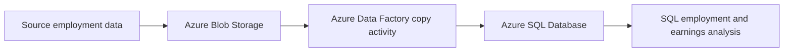

# Employment and Earnings Analysis with Azure SQL

A cloud-based SQL analysis of employment and earnings fields across occupations, years, and gender, developed for **MIE1628: Cloud-Based Data Analytics** at the University of Toronto.

## Project overview

The coursework demonstrates a data ingestion workflow using Azure Storage, Azure Data Factory, and Azure SQL Database, followed by nine analytical questions. The report includes resource setup, a Data Factory copy activity and run history, and SQL queries with their results.

**Tools:** Azure Blob Storage, Azure Data Factory, Azure SQL Database, T-SQL, Azure Resource Manager.

## Analysis covered

- Filter computer, engineering, and science occupations for 2013.
- Count distinct business and financial operations occupations.
- Retrieve bus driver records across years.
- Summarize female worker counts in management, business, and financial occupations by year.
- Aggregate the male earnings field for service occupations in 2015.
- Calculate female worker counts in management for 2015.
- Compare male and female earnings field sums by year.
- Aggregate the female earnings field for occupation names containing `engineer` in 2016.
- Compare male and female worker counts by year.

The SQL file contains ten statements: the first question includes both full records and a distinct occupation list.

## Repository contents

| File | Purpose |
| --- | --- |
| [sql/analysis.sql](sql/analysis.sql) | Queries transcribed from the original report, with their logic preserved |
| [docs/analysis-notes.md](docs/analysis-notes.md) | Data assumptions, query limitations, and validation status |
| [docs/reproduction.md](docs/reproduction.md) | Requirements and steps for reproducing the analysis |

## Running the analysis

1. Obtain the original employment dataset and its data dictionary.
2. Load the data into Azure SQL Database as `dbo.genderdata`, preserving the column names expected by the queries.
3. Review [reproduction requirements](docs/reproduction.md) and [analysis notes](docs/analysis-notes.md).
4. Execute statements individually from [analysis.sql](sql/analysis.sql) in an Azure SQL-compatible query editor.

## Data and reproducibility status

This repository was assembled from the submitted report and screenshots. The original dataset, source URL, full table definition, and exported Azure Data Factory configuration were not included in the supplied archive. Consequently, it is a documented coursework portfolio rather than a one-command deployment. No substitute dataset or fabricated results are included.

The report shows query executions against the coursework database. The extracted SQL has been checked against the report but has **not been re-executed** against a live database during repository preparation.

Original screenshots and the PDF are omitted from the public package because they contain account and cloud infrastructure details. The analysis does not establish a causal gender pay gap; earnings-field sums need the source data dictionary before economic interpretation.
